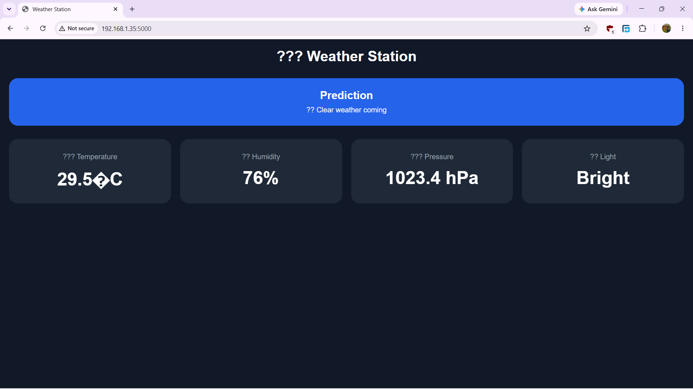

# 🌤️ Raspberry Pi Weather Station

A simple weather station built using a **Raspberry Pi 5**, **Flask**, and **Python**. The project collects data from multiple sensors and displays it on a live web dashboard accessible from any device on the same Wi-Fi network.

## Features

- 🌡️ Temperature monitoring using DHT11
- 💧 Humidity monitoring using DHT11
- 🌪️ Atmospheric pressure monitoring using BMP180/BMP280
- 💡 Light detection using an LDR module
- 🤖 Simple weather prediction based on pressure trends
- 🌐 Live Flask web dashboard
- 📱 Mobile-friendly interface
- 🔄 Automatic dashboard updates
- 🧩 Modular sensor libraries
- 🚀 Easy to extend with additional sensors

---

## Hardware Used

| Component | Quantity |
|-----------|-----------|
| Raspberry Pi 5 | 1 |
| DHT11 Temperature & Humidity Sensor | 1 |
| LDR Module (Digital Output) | 1 |
| BMP180/BMP280 Pressure Sensor | 1 |
| Breadboard | 1 |
| Jumper Wires | Several |
| RGB LED (Optional) | 1 |

---

## Project Structure

```text
weather_station/
│
├── app.py
├── dht11.py
├── ldr.py
├── bmp180.py
├── predictor.py
│
├── templates/
│   └── index.html
│
├── static/
│   └── style.css
│
├── requirements.txt
└── README.md
```

---

## Installation

### 1. Update System

```bash
sudo apt update
sudo apt upgrade
```

### 2. Install System Dependencies

```bash
sudo apt install python3-pip python3-venv python3-lgpio i2c-tools
```

### 3. Create Virtual Environment

```bash
python3 -m venv --system-site-packages venv
source venv/bin/activate
```

### 4. Install Python Packages

```bash
pip install flask
pip install adafruit-circuitpython-dht
pip install adafruit-circuitpython-bmp280
```

---

## Enable I²C

```bash
sudo raspi-config
```

Navigate to:

```text
Interface Options
    → I2C
        → Enable
```

Reboot:

```bash
sudo reboot
```

---

## Running the Project

Activate the virtual environment:

```bash
source venv/bin/activate
```

Start the Flask server:

```bash
python app.py
```

You should see something similar to:

```text
* Running on http://127.0.0.1:5000
* Running on http://192.168.x.x:5000
```

---

## Accessing the Dashboard

On the Raspberry Pi:

```text
http://127.0.0.1:5000
```

From another device on the same Wi-Fi:

```text
http://<RASPBERRY_PI_IP>:5000
```

Find the Pi's IP address:

```bash
hostname -I
```

---

## API Endpoint

```text
GET /api/data
```

Example Response:

```json
{
    "temperature": 30,
    "humidity": 68,
    "pressure": 1013.24,
    "light": 1,
    "prediction": "stable",
    "prediction_text": "🌥️ Stable conditions"
}
```

---

## Sensor Libraries

### DHT11

```python
import dht11

dht11.dht(4)

temp = dht11.temperature()
hum = dht11.humidity()
```

### LDR

```python
import ldr

ldr.ldr(17)

light = ldr.value()
```

### BMP180/BMP280

```python
import bmp180

bmp180.bmp180()

pressure = bmp180.pressure()
temperature = bmp180.temperature()
```

---

## Weather Prediction

The system predicts weather conditions using atmospheric pressure trends.

Possible predictions:

- Collecting Data
- Stable Conditions
- Clear Weather Coming
- Rain Likely

---

## Future Improvements

- 📈 Live charts using Chart.js
- 💾 CSV logging
- 🔴🟢🔵 RGB status indicator
- 📊 Historical data analysis
- ☁️ Cloud data storage
- 📲 Push notifications
- 🌦️ Real weather API integration
- 🛰️ Multiple weather station support

---

## Dashboard Screenshot

<p align="center">
  
</p>


## License

This project is licensed under the MIT License.

---

## Author

**dominicpe2k04**
**email : dominicpe2k04@gmail.com**


Built with ❤️ using Raspberry Pi, Python, Flask, and GPIO.
